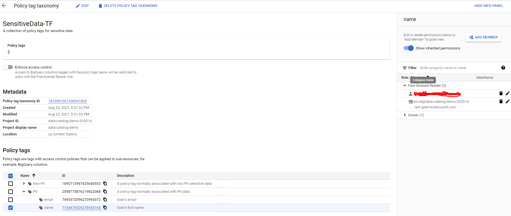
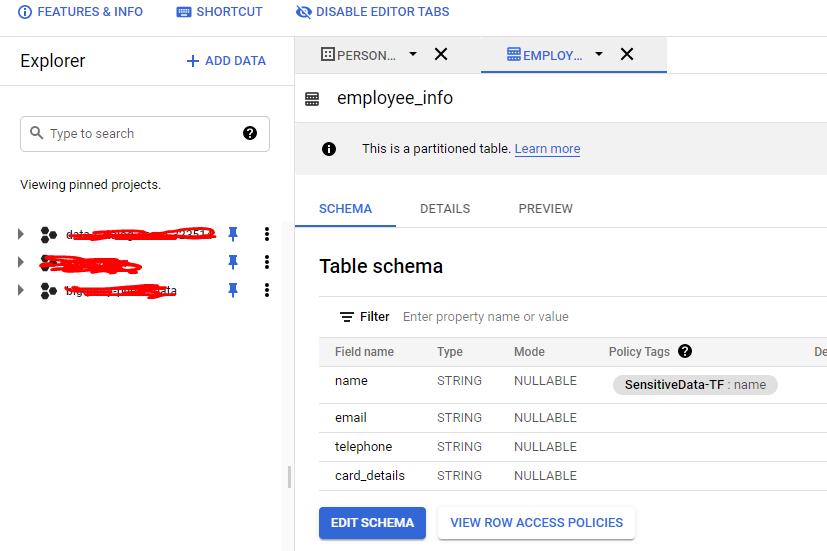

# Terraform for Google Data Catalog Policy Tag
This module helps create data catalog policy tags. Policy tags can be used to provide fine grained permissions to BigQuery columns.


Further reading : https://cloud.google.com/bigquery/docs/best-practices-policy-tags


* This module creates a taxonomy and adds policy tags along with members associated to a specific policy tag

* Analysis is required to identify a new access group and service accounts that read from BigQuery datasets and these should be added as members with fine grained permissions

* The addition of policy tags to specific BigQuery columns is currently not added in terraform

```
├── main.tf
├── README.md
├── terraform.tfvars
└── variables.tf
```

## Terraform Execution instructions

* pre-requisites

Update project_id and members in terraform.tfvars

```
project_id = "data-catalog-demo-323514"

policy_members = [
  "user:iamtheone.ankur@gmail.com",
  "serviceAccount:pii-sa@data-catalog-demo-323514.iam.gserviceaccount.com",
]
```

* init

```terraform init```

* plan

```terraform plan```

* apply

```terraform apply```

## Data Catalog policy tags
* On execution of terraform the below policy tags and taxanomy along with roles is created



* You can then add the policy tag to a BigQuery column

